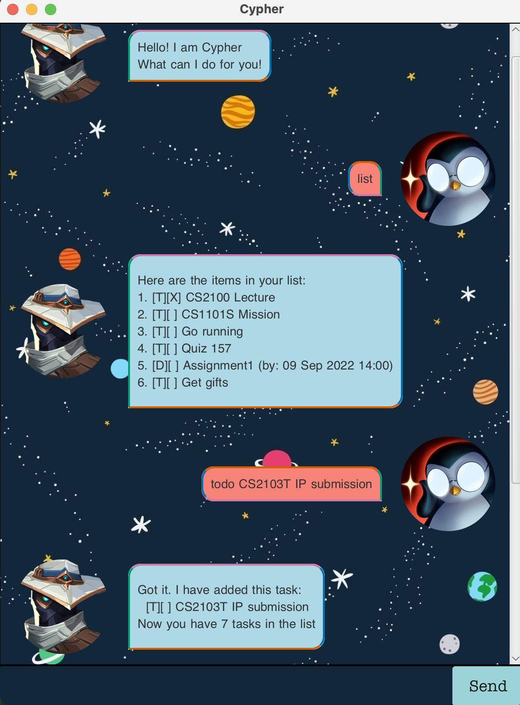

# Cypher User Guide



Welcome to Cypher, a chat bot application that keeps tracks of your various tasks such as Events, Deadlines and Todos. 
Imagine all of this done using the convenience of your command line interface. 

Well you don't have to imagine. Download and use Cypher now and discover a new way of managing your tasks. 

---
## Syntax of the User Guide
Words in between <> are the parameters to be supplied by the user.
e.g., in todo <description>, <description> is a parameter needs to be given by the user based on their preference

Example: `todo assignments`

Redundant or excess commands for commands that do not take in parameters from users will ignore these commands.

Example: `bye Cypher` will still close the application

Any < time > parameter tag must follow the format of `yyyy-MM-dd HH:mm`

---
## Not sure of the commands?: `help`
One of the most important and basic commands for new users getting to know the application. 

format: `help`

The help command lists all valid commands in the application, giving a description of the commands and the correct format for each command

---
## View my tasks: `list`

format: `list`

The list command showcases all tasks currently on your Cypher chat bot application

---
## Adding Tasks: `todo | deadline | event`
On the Cypher application, 3 different types of tasks can be created based on your needs.

### 1. todo task 
   * format: `todo <Description of task>`
   * The todo command allows you to add todo tasks to your list that do not have any time aspect to them.
   * Example: `todo example`
     * Expected output:
          ```
        Got it. I have added this task:
            [T][ ] example
        Now you have 3 tasks on your list
       ```
### 2. deadline task
   * format: `deadline <Description of task> /by <time>`
   * The deadline command allows you to add a deadline task that has a certain time to finish the task by
   * After giving the task description, use the /by keyword and then give your preferred time in the format of `yyyy-MM-dd HH:mm`
   * Example: `deadline example /by 2024-10-10 14:00`
     * Expected output:
         ```
          Got it. I have added this task:
              [D][ ] example (by: 10 Oct 2024 14:00)
          Now you have 4 tasks on your list
         ```
### 3. event task
* format: `event <Description of task> /from <time> /to <time>`
* The `event` command allows you to add a event task that has a certain time frame for the task
* After giving the task description, use the` /from` keyword and then give your preferred start time in the format of `yyyy-MM-dd HH:mm`. Then use the `/by` keyword to give your preferred end time.
* Ensure that `/from` is followed by `/to` if not the command will not be accepted
* Example: `event tp /from 2024-09-20 14:00 /to 2024-11-26 14:00`
    * Expected output:
        ```
         Got it. I have added this task:
             [E][ ] tp (from: 20 Sep 2024 14:00 || to: 26 Nov 2024 14:00)
         Now you have 5 tasks on your list
        ```
---
## _Completing your tasks_: `mark | unmark`
### 1. mark task
* format: `mark <Task Number>`
* The `mark` command allows you to mark a task as complete. The `Task Number` can be obtained by using the `list` command
* Example: `mark 3`
    * Expected output:
         ```
       Nice! I have marked this task as completed:
           [T][X] example
      ```
### 2. unmark task
* format: `unmark <Task Number>`
* The `mark` command allows you to mark a task as not complete. The `Task Number` can be obtained by using the `list` command.
* All newly added tasks have an uncompleted status by default
* Example: `unmark 3`
    * Expected output:
         ```
         Ok! I have marked this task as incomplete:
             [T][ ] example
         ```

---
## Deleting your tasks: `delete`
* format: `delete <Task Number>`
* The `delete` command allows you to delete a task. The `Task Number` can be obtained by using the `list` command.
* Example: `delete 3`
    * Expected output:
         ```
         Noted! I have removed this task:
             [T][ ] Go running
         ```

---
## Searching for tasks: `find`
* format: `find <phrase>`
* The `find` command allows you to search for tasks whose description contains this phrase.
* Note: this command is case-insensitive 
* Example: `find amp`
    * Expected output:
         ```
         Here are the items in your list that match the search
             1. [T][ ] example
             2. [D][ ] example (by: 10 Oct 2024 14:00)
         ```
---
## Sorting your tasks: `sort`
* format1: `sort ascending`
* format2: `sort descending`
* The `sort` command allows you to sort your tasks by time. All tasks of a certain type will be grouped togther and the order by time either asecnding or descending
  * Example: `sort ascending`
      * Expected output:
           ```
           Here are the items in your list that match the search
               1. [T][ ] CS2100 Lecture
               2. [D][ ] example (by: 10 Sep 2024 14:00)
               3. [D][ ] assignment 1 (by: 20 Oct 2024 14:00)
               4. [E][ ] tp (from: 20 Sep 2024 1400 || to: 26 Nov 2024)
               5. [E][ ] dance practice (from: 18 Sep 2024 1500 || to: 19 Nov 2024)
           ```
---
## Closing the ChatBot: `bye`
* format: `bye`
* You can close the chatbot using the `bye` command. The application will close 3 seconds after the commands is given